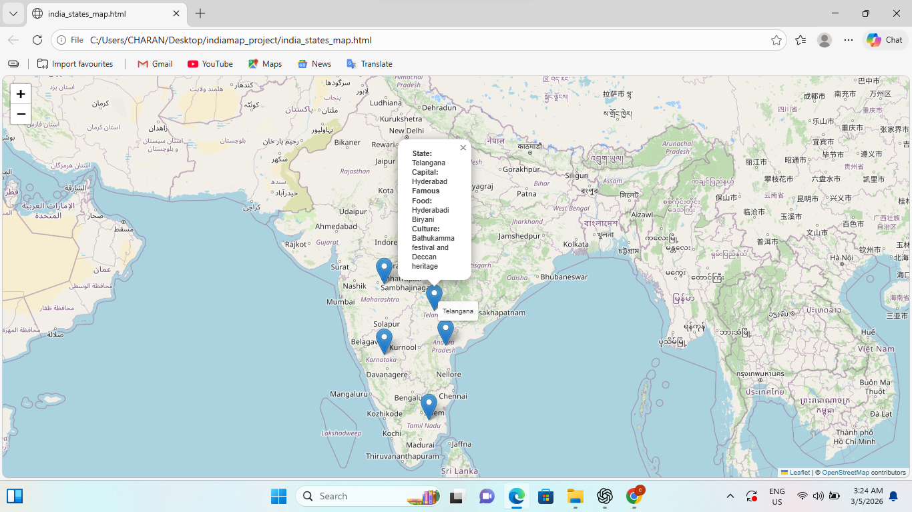

# india_map_python_project
# India States Interactive Map using Python Folium

## Project Description

This project creates an **interactive map of India** using Python and the Folium library. The map displays markers for different states, and when a user clicks on a marker, a popup appears showing important information about that state.

The popup includes:

* State name
* Capital city
* Famous food item
* Cultural highlight

This project demonstrates how geographic data can be visualized using Python and how interactive maps can be created for educational or informational purposes.

## Technologies Used

* Python
* Folium library

## Features

* Interactive map centered on India
* Markers placed on different states
* Clickable popups displaying state information
* Tooltips showing state names when hovering over markers
* Map exported as an HTML file that can be opened in any web browser

## How It Works

1. The program imports the Folium library.
2. A map object centered on India is created.
3. A list of dictionaries stores information about each state including:

   * State name
   * Capital city
   * Famous food
   * Cultural details
   * Latitude and longitude coordinates
4. A loop iterates through the list and places markers on the map.
5. Each marker contains a popup displaying the state's information.
6. The map is saved as an HTML file (`india_states_map.html`).

## Output

Running the script generates an interactive HTML map. When opened in a browser, users can click on markers to view information about each state.

## Learning Outcome

This project helps in understanding:

* Basic Python data structures
* Geographic data visualization
* Creating interactive maps using Folium
* Exporting maps as web-based HTML files
* ##output
* 
